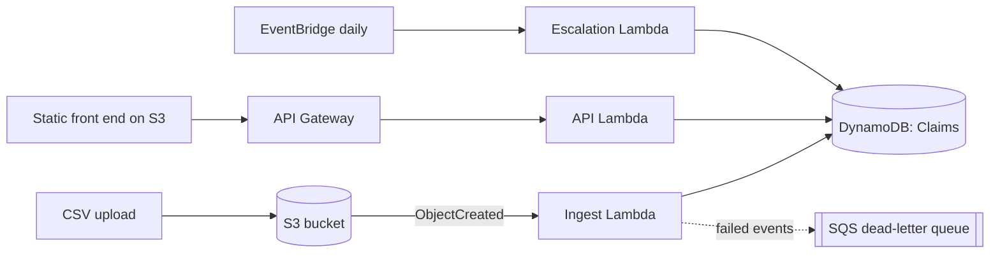
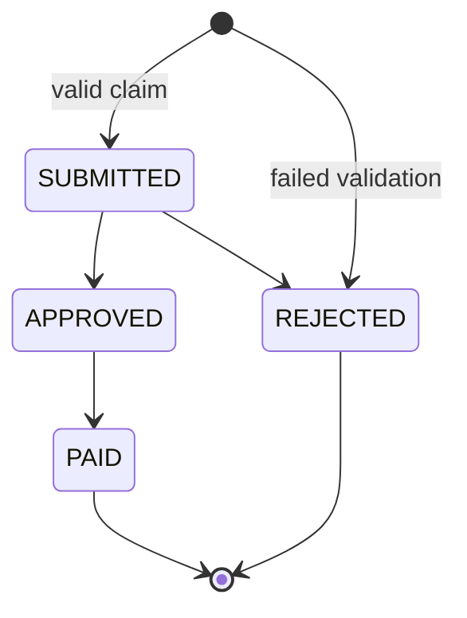

# Reimbursement Claims Workflow Automation

A serverless system on AWS that validates reimbursement claims automatically,
enforces an approval lifecycle, and shows where claims get stuck.

> **Status:** Stage 1 of 6 complete (state machine + validation, fully tested).
> Sections marked _TODO_ are filled in as later stages land.

## Problem statement

A college club/department handles reimbursement claims through WhatsApp photos
and a spreadsheet. As a result:

- the same bill gets claimed twice,
- claims arrive with missing fields,
- amounts exceed category limits,
- claims sit unapproved for weeks and nobody notices.

This project replaces that process with CSV/API intake, automatic validation,
a strict approval lifecycle, and a dashboard that highlights stuck claims.

## Architecture



## Claim lifecycle



Nothing else is legal. `ESCALATED` is a flag on a `SUBMITTED` claim, not a state.

## Validation rules

| Field | Rule |
| --- | --- |
| all of `claim_id, claimant, category, amount, bill_id, date` | present and non-blank |
| `claim_id` | 1-64 chars: letters, digits, `-`, `_` (it appears in URLs) |
| `category` | one of the configured categories (case-insensitive) |
| `amount` | positive number, at most 2 decimals, not above the category limit |
| `date` | real `YYYY-MM-DD` date, not in the future |
| `bill_id` | not already used by another claim (case/whitespace-insensitive) |

## Project structure

```
src/claims/
  states.py        state machine (pure Python)
  validation.py    validation rules (pure Python)
  ...              DynamoDB layer, handlers (later stages)
tests/
requirements.txt
requirements-dev.txt
pytest.ini
```

## Running the tests

```bash
python -m venv .venv && source .venv/bin/activate
pip install -r requirements-dev.txt
pytest --cov=claims --cov-report=term-missing
```

## Deploying

_TODO (Stage 3): `sam build && sam deploy --guided`._

## API reference

_TODO (Stage 4)._

## Cost control

Everything is designed to stay in the AWS free tier (Lambda, DynamoDB
on-demand, S3, SQS, EventBridge, API Gateway). Create a **billing alarm**
before deploying: Billing console -> Budgets -> create a zero-spend or
low-threshold budget with an email alert.

## Design decisions

_TODO: expanded in Stage 6. Topics to cover:_

- **Why conditional writes** - _TODO (Stage 2)._
- **Why business logic is separate from handlers** - `states.py` and
  `validation.py` import nothing from AWS, so every rule is tested with plain
  `pytest` in milliseconds, and handlers stay thin wrappers.
- **Why a dead-letter queue** - _TODO (Stage 3)._
- **What I would change at scale** - Cognito auth, pagination, idempotency keys.
